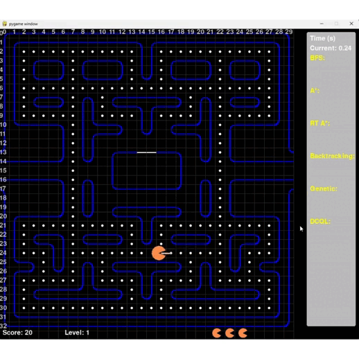
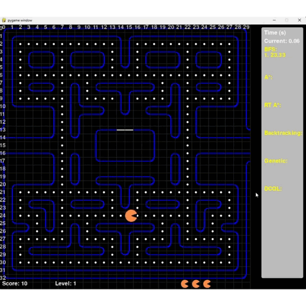
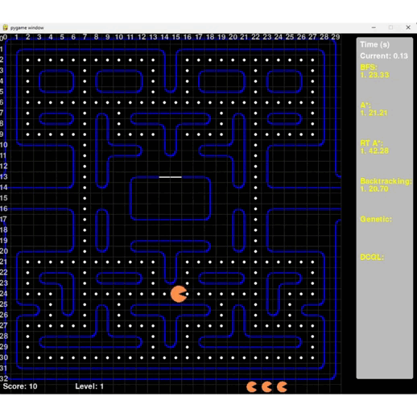
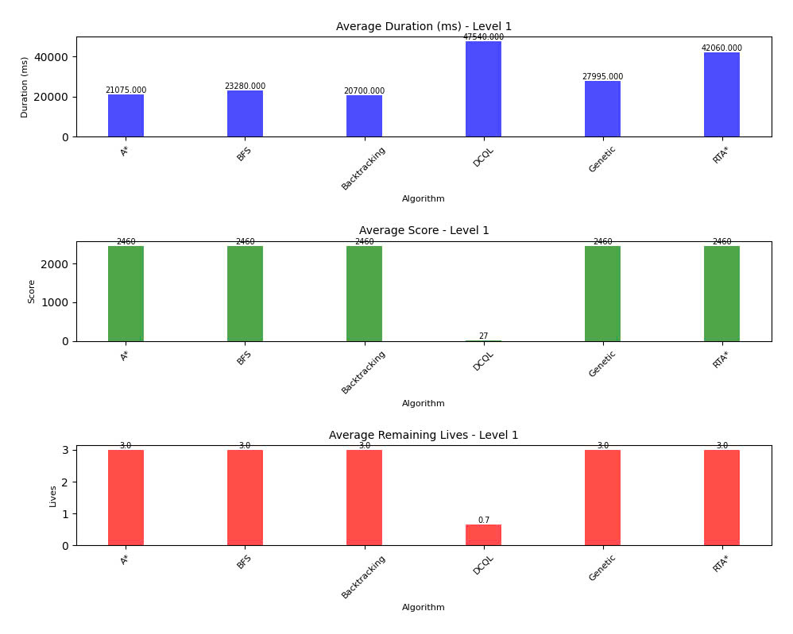
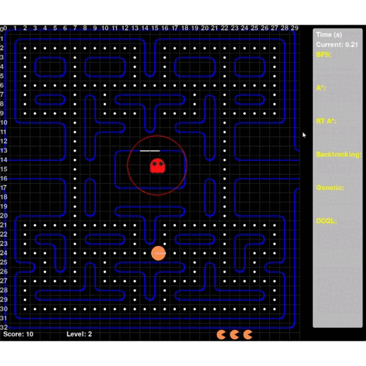
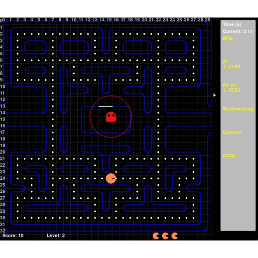
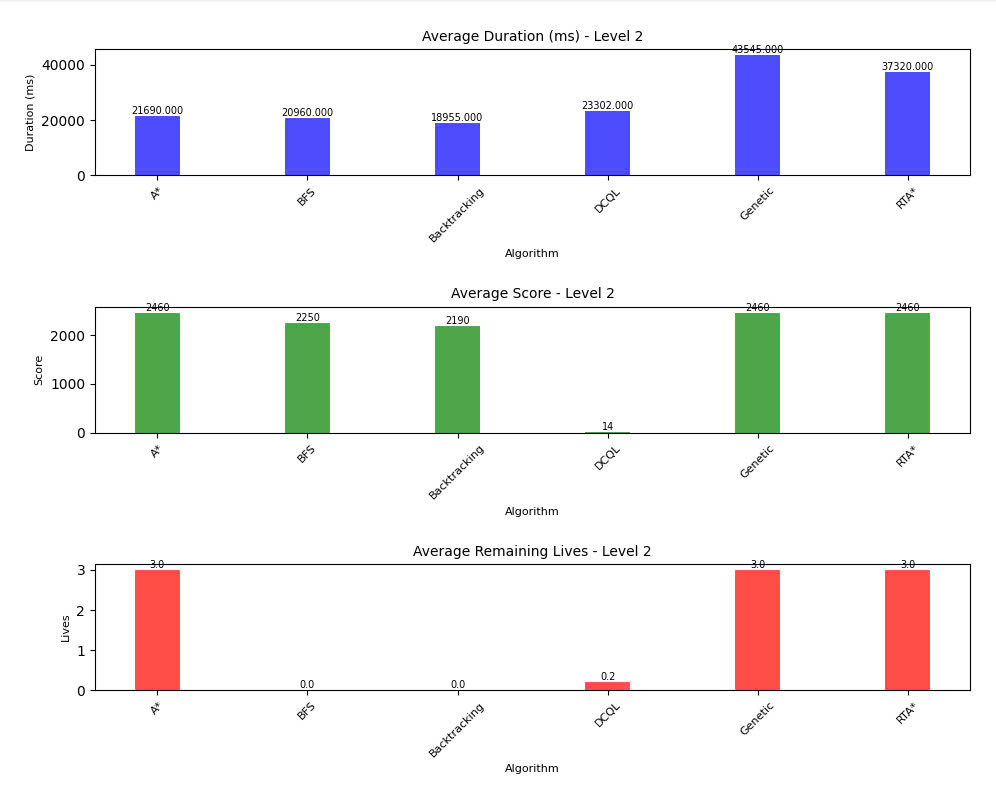
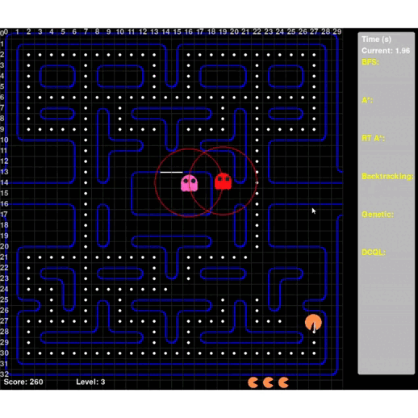
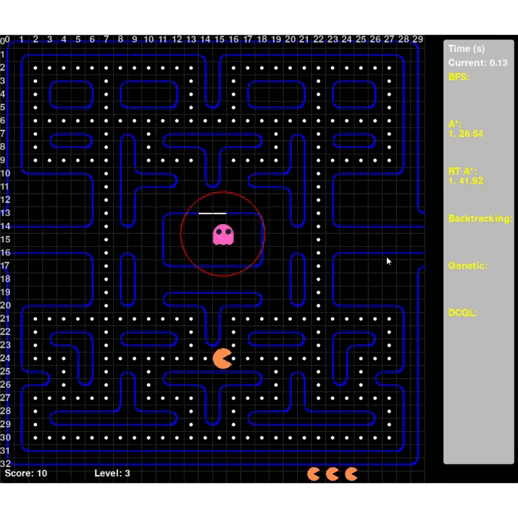
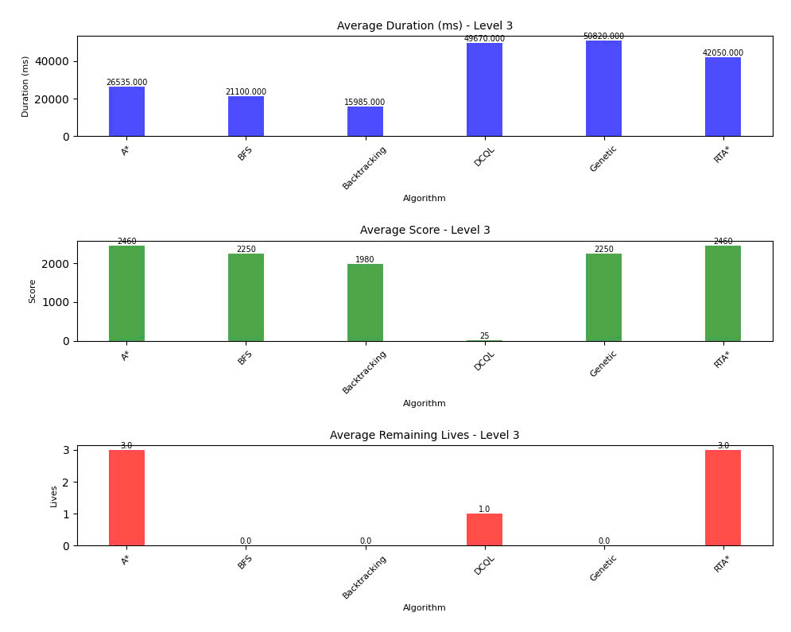

# Dự án Pac-Man AI

Dự án này triển khai trò chơi Pac-Man cổ điển với nhiều thuật toán AI khác nhau để điều khiển Pac-Man. Trò chơi được xây dựng bằng Pygame, và các thuật toán tìm đường và ra quyết định khác nhau được triển khai để điều hướng mê cung, ăn các chấm và tránh ma.

## Tính năng

- **Chơi thủ công:** Điều khiển Pac-Man bằng các phím mũi tên.
- **Thuật toán AI:**
  - Tìm kiếm theo chiều rộng (BFS)
  - Tìm kiếm A\* (A-Star)
  - A\* Thời gian thực (RTA\*)
  - Quay lui (Backtracking)
  - Thuật toán Di truyền (Genetic Algorithm)
  - Học Q Sâu Dựa Trên Mạng Tích Chập (DCQL)
- **Nhiều màn chơi:** Chơi ở các màn chơi khác nhau với số lượng ma khác nhau.
- **Thống kê trò chơi:** Theo dõi và so sánh hiệu suất của các thuật toán AI khác nhau (thời gian, điểm số, mạng sống).
- **AI của Ma:** Các con ma với các kiểu di chuyển riêng biệt (Blinky, Pinky, Inky, Clyde).

## Cách chạy

1.  Đảm bảo bạn đã cài đặt Python và Pygame.
2.  Cài đặt các thư viện phụ thuộc khác:
    ```bash
    pip install numpy torch gymnasium ale-py matplotlib
    ```
3.  Chạy file game chính:
    ```bash
    python game.py
    ```
    Thao tác này sẽ mở cửa sổ trò chơi nơi bạn có thể chọn chế độ chơi (thủ công hoặc thuật toán AI) và màn chơi.

## Cấu trúc file

- `game.py`: Logic chính của trò chơi, vòng lặp Pygame và tích hợp AI.
- `board.py`: Định nghĩa bố cục bảng trò chơi cho các màn chơi khác nhau.
- `player.py`: Triển khai nhân vật người chơi Pac-Man.
- `ghost.py`: Triển khai các nhân vật ma và AI của chúng.
- `logic.py`: Chứa việc triển khai các thuật toán tìm đường và AI (BFS, A\*, RTA\*, Backtracking, Genetic).
- `train_dcqn.py`: Script để huấn luyện mô hình Deep Convolutional Q-Learning.
- `dcql_model_episode_*.pth`: Các file mô hình đã lưu cho tác nhân DCQL.
- `game_stats.csv`: File CSV để lưu trữ số liệu thống kê trò chơi nhằm phân tích hiệu suất.
- `assets/`: Chứa các tài sản của trò chơi như hình ảnh và âm thanh.

## Các thuật toán AI đã triển khai

Các thuật toán AI sau được triển khai trong [`logic.py`](d%3A%5Cpy%5CProject_AI_CK%5CProject_Pacman_AI%5Clogic.py):

- **BFS:** [`Pathfinder.bfs()`](d%3A%5Cpy%5CProject_AI_CK%5CProject_Pacman_AI%5Clogic.py)
- **A\*:** [`Pathfinder.A_star()`](d%3A%5Cpy%5CProject_AI_CK%5CProject_Pacman_AI%5Clogic.py)
- **RTA\*:** [`Pathfinder.rta_star_realtime()`](d%3A%5Cpy%5CProject_AI_CK%5CProject_Pacman_AI%5Clogic.py)
- **Backtracking:** [`Pathfinder.backtracking()`](d%3A%5Cpy%5CProject_AI_CK%5CProject_Pacman_AI%5Clogic.py)
- **Genetic Algorithm:** [`Pathfinder.genetic()`](d%3A%5Cpy%5CProject_AI_CK%5CProject_Pacman_AI%5Clogic.py)

Tác nhân Deep Convolutional Q-Learning (DCQL) được huấn luyện bằng cách sử dụng [`train_dcqn.py`](d%3A%5Cpy%5CProject_AI_CK%5CProject_Pacman_AI%5Ctrain_dcqn.py) và được tích hợp vào [`game.py`](d%3A%5Cpy%5CProject_AI_CK%5CProject_Pacman_AI%5Cgame.py).

## Mô tả các Level và Thuật toán AI

Dưới đây là mô tả trực quan về cách các thuật toán AI khác nhau hoạt động trong từng màn chơi.

### Level 1 (Màn chơi cơ bản)

- **BFS (Tìm kiếm theo chiều rộng):**

  

- **A\* (A-Star):**

  

- **RTA\* (A\* Thời gian thực):**

  

- **Backtracking (Quay lui):**

  

- **Genetic Algorithm (Thuật toán Di truyền):**

  

- **DCQL (Học Q Sâu Dựa Trên Mạng Tích Chập):**

  

|        **BFS (Tìm kiếm theo chiều rộng)**        |                **A\* (A-Star)**                 |          **RTA\* (A\* Thời gian thực)**           |
| :----------------------------------------------: | :---------------------------------------------: | :-----------------------------------------------: |
|  |  |  |

|                **Backtracking (Quay lui)**                |     **Genetic Algorithm (Thuật toán Di truyền)**     |   **DCQL (Học Q Sâu Dựa Trên Mạng Tích Chập)**    |
| :-------------------------------------------------------: | :--------------------------------------------------: | :-----------------------------------------------: |
|  |  |  |

#### Thống kê Level 1



Ở môi trường level 1, không có ghost thì có thể coi là môi trường tĩnh. Vì vậy hầu hết các agent chạy các thuật toán đều đạt được kết quả tốt và hoàn thiện. Cụ thể:
+ Thuật toán A*: A* có thời gian hoàn thành nhanh nhất nhưng số điểm thấp hơn một chút. Ở đây A* đã thể hiện được điểm mạnh trong việc chọn con đường tối ưu trong tương lai và khả năng nhìn xa vì vậy tối ưu tốc độ ăn các viên thức ăn và tránh được ghost. 
+ BFS, Backtracking, Genetic: ba thuật toán trên đem lại hiệu suất tương đối đồng đều với thời gian chạy không chênh lệch nhiều. Điều đó cho thấy ba chiến lược tìm kiếm với môi trường board trên đem lại hiệu năng khá tương đồng: duyệt theo chiều rộng với BFS, duyệt theo chiều sâu kết hợp ràng buộc và heuristic của Backtracking và giải thuật di truyền với hàm fitness đã mang lại đánh giá khá chính xác và tối ưu số điểm. 
+ RTA*: Thuật toán có độ hoàn thiện nhưng chưa tối ưu với môi trường tĩnh do RTA* chỉ nhìn được không gian cục bộ 5 ô về 4 hướng. Vì vậy dễ bị mắc bẫy cục bộ trong khi chưa tìm được đường tới pallet. 
+ DCQL: agent chưa được train đủ lâu và bộ dữ liệu chưa nhiều nên kết quả còn khá khiêm tốn.

### Level 2 (Màn chơi với nhiều ma hơn)

- **BFS (Tìm kiếm theo chiều rộng):**

  

- **A\* (A-Star):**

  

- **RTA\* (A\* Thời gian thực):**

  

- **Backtracking (Quay lui):**

  

- **Genetic Algorithm (Thuật toán Di truyền):**

  

- **DCQL (Học Q Sâu Dựa Trên Mạng Tích Chập):**

  

|        **BFS (Tìm kiếm theo chiều rộng)**        |                **A\* (A-Star)**                 |          **RTA\* (A\* Thời gian thực)**           |
| :----------------------------------------------: | :---------------------------------------------: | :-----------------------------------------------: |
|  |  |  |

|                **Backtracking (Quay lui)**                |     **Genetic Algorithm (Thuật toán Di truyền)**     |   **DCQL (Học Q Sâu Dựa Trên Mạng Tích Chập)**    |
| :-------------------------------------------------------: | :--------------------------------------------------: | :-----------------------------------------------: |
|  |  |  |

#### Thống kê Level 2



Ở môi trường level 2, có 1 ghost di chuyển liên tục, thay đổi tính chất môi trường từ tĩnh đơn mục tiêu thành động và đa mục tiêu (vừa ăn pellet vừa tránh ghost). Vì vậy đã có một số agent bộc lộ điểm yếu trong môi trường động và thay đổi liên tục:
+ A*: A* vẫn đem lại hiệu suất tốt nhất với thời gian chạy nhanh nhất và khả năng tránh ghost tốt để không bị mất mạng nào. Giải thuật A* tính toán toàn cục kết hợp với việc tối ưu hàm heuristic, phản ứng thời gian thực và tái tính toán đường đi, cùng với đó là việc thêm penalty phạt nặng khi gần ghost đã mang lại hiệu quả tương đối ổn định cho cả hai mục tiêu ăn pellet và tránh ghost. 
+ RTA*: RTA* cũng hoàn thiện trong màn chơi này. Thuật toán thể hiện được khả năng phản ứng nhanh trước các thay đổi của môi trường (ở đây là vị trí ghost thay đổi liên tục) từ đó có khả năng tránh ghost hoàn hảo. Tuy nhiên điểm yếu về không tối ưu toàn cục tốt đã làm cho agent mất nhiều thời gian hơn để hoàn thành mục tiêu ăn hết viên pellet. 
+ Genetic: Genetic cũng hoàn thiện trong màn chơi này dù mất thời gian lâu nhất. Kết quả trên chứng tỏ hàm fitness là tương đối hiệu quả trong việc thực hiện cả hai mục tiêu ăn pellet và tránh ghost, thể hiện điểm mạnh của thuật toán trong môi trường phức tạp và mục tiêu không xác định. Tuy nhiên việc mất nhiều thời gian có lẽ do hạn chế trong kích thước quần thể(population_size = 60 và max_generations = 200), tỉ lệ đột biến chưa đủ để thoát khỏi cục bộ địa phương hoặc cơ chế chọn lọc chưa đủ đa dạng (hiện là giữ lại 50% cá thể tốt nhất). 
+ BFS, Backtracking: Vẫn có số điểm khá cao nhưng lại không hoàn thiện trong màn chơi. Agent mất hết số mạng do va chạm với ghost. Điều đó thể hiện đúng bản chất của BFS là thuật toán tìm kiếm mù, vì vậy không thể xác định được vị trí của ghost để né. Trong khi backtracking thì cũng không phải là thuật toán tối ưu để xử lý thay đổi thời gian thực và liên tục, ở đây là vị trí của ghost.
+ DCQL: agent chưa được train đủ lâu và bộ dữ liệu chưa nhiều nên kết quả còn khá khiêm tốn.

### Level 3 (Màn chơi phức tạp)

- **BFS (Tìm kiếm theo chiều rộng):**

  

- **A\* (A-Star):**

  

- **RTA\* (A\* Thời gian thực):**

  

- **Backtracking (Quay lui):**

  

- **Genetic Algorithm (Thuật toán Di truyền):**

  

- **DCQL (Học Q Sâu Dựa Trên Mạng Tích Chập):**

  

|        **BFS (Tìm kiếm theo chiều rộng)**        |                **A\* (A-Star)**                 |          **RTA\* (A\* Thời gian thực)**           |
| :----------------------------------------------: | :---------------------------------------------: | :-----------------------------------------------: |
|  |  |  |

|                **Backtracking (Quay lui)**                |     **Genetic Algorithm (Thuật toán Di truyền)**     |   **DCQL (Học Q Sâu Dựa Trên Mạng Tích Chập)**    |
| :-------------------------------------------------------: | :--------------------------------------------------: | :-----------------------------------------------: |
|  |  |  |

#### Thống kê Level 3



Ở môi trường level 3, có 2 ghost di chuyển liên tục, tăng độ khó và phức tạp của môi trường động và đa mục tiêu (vừa ăn pellet vừa tránh ghost). Vì vậy có rất nhiều agent không thể hoàn thiện: 
+ A*: A* vẫn đem lại hiệu suất tốt nhất với thời gian chạy nhanh nhất và khả năng tránh ghost tốt để không bị mất mạng nào. Giải thuật A* tính toán toàn cục kết hợp với việc tối ưu hàm heuristic, phản ứng thời gian thực và tái tính toán đường đi, cùng với đó là việc thêm penalty phạt nặng khi gần ghost đã mang lại hiệu quả tương đối ổn định cho cả hai mục tiêu ăn pellet và tránh ghost. Các yếu tố trên vẫn đáp ứng được trong môi trường hai ghost. 
+ RTA*: RTA* cũng hoàn thiện trong màn chơi này. Thuật toán thể hiện được khả năng phản ứng nhanh trước các thay đổi của môi trường (ở đây là vị trí ghost thay đổi liên tục) từ đó có khả năng tránh ghost hoàn hảo. Tuy nhiên điểm yếu về không tối ưu toàn cục tốt đã làm cho agent mất nhiều thời gian hơn để hoàn thành mục tiêu ăn hết viên pellet. 
+ Genetic: GA không hoàn thiện trong màn chơi này. Kết quả trên chứng tỏ hàm fitness đã bộc lộ điểm yếu trong việc thực hiện cả hai mục tiêu ăn pellet và tránh ghost. GA hoạt động theo thế hệ, cần nhiều thời gian để tính toán quần thể, lai ghép, đột biến, và đánh giá fitness. Trong môi trường động, vị trí của ma thay đổi liên tục, nhưng GA không thể cập nhật đường đi theo thời gian thực vì nó dựa trên một quần thể tĩnh tại mỗi lần chạy. 
+ BFS, Backtracking: Vẫn có số điểm khá cao nhưng lại không hoàn thiện trong màn chơi. Agent mất hết số mạng do va chạm với ghost. Điều đó thể hiện đúng bản chất của BFS là thuật toán tìm kiếm mù, vì vậy không thể xác định được vị trí của ghost để né. Trong khi backtracking thì cũng không phải là thuật toán tối ưu để xử lý thay đổi thời gian thực và liên tục, ở đây là vị trí của ghost.
+ DCQL: agent chưa được train đủ lâu và bộ dữ liệu chưa nhiều nên kết quả còn khá khiêm tốn.


